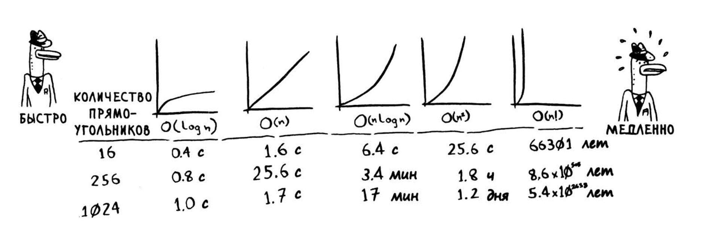

1. Имеется отсортированный список из 128 имен, и вы ищете в нем значение методом бинарного поиска. Какое максимальное количество проверок для этого может потребоваться?

```
128 -> 64 -> 32 -> 16 -> 8 -> 4 -> 2 -> 1
const max_checked = Math.ceil(128 / 2 / 2 / 2 / 2 / 2 / 2 / 2);
```

2. Предположим, размер списка увеличился вдвое. Как изменится максимальное количество проверок?

```
256 -> 128 -> 64 -> 32 -> 16 -> 8 -> 4 -> 2 -> 1
const max_checked_x2 = Math.ceil(256 / 2 / 2 / 2 / 2 / 2 / 2 / 2 / 2);
```

Обычный поиск (по элементный) -> O(n), где n = arr.length: для 4 000 000 000 = столько же попыток

Бинарный поиск -> O(Log n), где n = arr.length: для 4 000 000 000 = 32 попытки

"O-большое" описывает насколько быстро растет алгоритм, а n - количество операций

### Примеры

#### Ниже перечислены пять разновидностей «О-большого», которые будут встре­ чаться вам особенно часто, в порядке убывания скорости выполнения:

- [x] O(log n), или логарифмическое время. Пример: бинарный поиск.
- [x] О(n), или линейное время. Пример: простой поиск.
- [ ] О(n \* log n). Пример: эффективные алгоритмы сортировки (быстрая сортировка - но об этом в главе 4).
- [ ] О(n^2 ). Пример: медленные алгоритмы сортировки (сортировка выбором - см. главу 2).
- [ ] О(n!). Пример: очень медленные алгоритмы (задача о коммивояжере - о ней будет рассказано в следующем разделе).

### Ниже показано, сколько времени потребуется для построения сетки с остальными алгоритмами, от самого быстрого до самого медленного:


